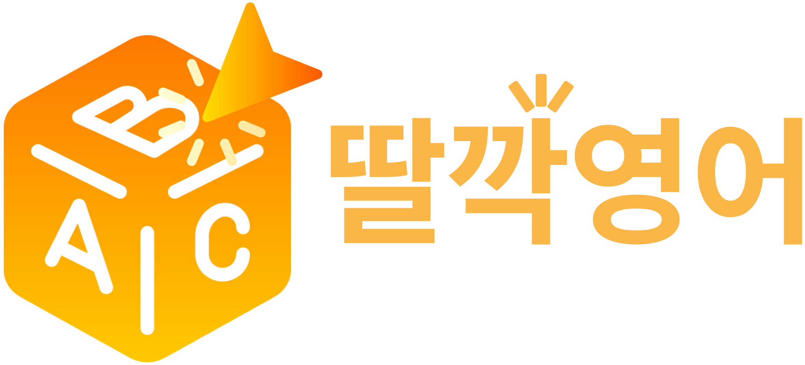

<p align="center">
  
</p>


> AI가 뉴스 기사를 분석해 단어를 자동 추출해주는  
> 대한민국 1위! AI 기반 영어 단어 학습 플랫폼

🌐 [배포 링크 바로가기](https://ddalkkak-english.netlify.app/)

---

## 👥 팀원 소개

<table align="center">
  <thead>
    <tr>
      <th>역할</th>
      <th>PO</th>
      <th>SM</th>
      <th>Developer</th>
      <th>Developer</th>
      <th>Developer</th>
    </tr>
  </thead>
  <tbody>
    <tr>
      <td>이름</td>
      <td>한상휘</td>
      <td>한사라</td>
      <td>안치호</td>
      <td>정민지</td>
      <td>박영욱</td>
    </tr>
  </tbody>
</table>

---

## 📱 모바일 UI 미리보기

| 랜딩 | 로그인 | 기사 | 단어장 | 테스트 |
|:--:|:--:|:--:|:--:|:--:|
|  |  |  |  |  |

> ✨ 주요 기능: 기사 기반 단어 학습 · 단어장 저장 · 단어 테스트 · 구글 로그인 · 반응형 웹


---

## ✨ 주요 기능 요약

- 💡 AI 기사 분석으로 단어 자동 추출
- 📰 카테고리별 기사 필터링
- 📦 단어장 저장 및 검색 기능
- 🧪 테스트 모드 (영→한 / 한→영)
- 🔐 이메일 및 구글 계정 로그인 지원
- 📱💻 반응형 디자인 (모바일/웹 지원)

---

## 🛠️ 기술 스택 상세 설명


| 기술 스택             | 설명 |
|------------------------|------|
| **React + Vite**       | 빠른 개발환경과 최적화된 번들링 |
| **MUI**                | 반응형 UI 구성 및 일관된 컴포넌트 스타일 |
| **React Router v6**    | 페이지 라우팅 처리 |
| **React Query**        | GPT API 및 웹 검색 결과의 상태 관리, 캐싱 |
| **Zustand**            | 클라이언트 단 상태 관리 (단어장, 테스트 등) |
| **Firebase Auth**      | 이메일/비밀번호 로그인 + Google OAuth |
| **OpenAI API**         | GPT-4o-mini 및 GPT-4.1을 통한 기사 분석 및 단어 추출 |
| **Netlify (Serverless)**| 정적 웹사이트 배포 및 서버리스 함수 연동

---

## 🤖 사용한 AI / 오픈소스 API

- **OpenAI GPT-4o-mini / GPT-4.1 API**  
  뉴스 기사에서 주요 단어 및 표현을 추출할 때 사용  
  커스텀 프롬프트를 기반으로 `.netlify/functions/getResponse`, `getWebSearch` 함수를 통해 호출

- **React Query (@tanstack/react-query)**  
  GPT API 및 웹 검색 결과의 캐싱, 로딩 상태, 재시도 처리 등 클라이언트 상태 관리에 사용

---

## 📁 폴더 구조

```
src/
├── assets/ # 이미지 및 공용 리소스
├── common/
│ └── components/
│ └── Buttons/ # 공통 버튼 컴포넌트 (GoogleLogin 등)
├── hooks/ # 커스텀 훅
├── layouts/ # AppLayout (NavBar, Footer 포함)
├── pages/
│ ├── LandingPage/ # 랜딩 페이지
│ ├── LoginPage/ # 로그인 및 회원가입
│ ├── MainPage/ # 기사 기반 학습 메인
│ └── VocabPage/ # 단어장 및 테스트
├── router/ # 라우팅 관련 설정
├── stores/ # Zustand 상태 관리
├── util/ # 유틸리티 함수
├── App.jsx
├── App.css
├── index.css
├── main.jsx
```
---

## 🚀 사용법

1. [배포 링크](https://ddalkkak-english.netlify.app/)로 이동
2. 플로팅 버튼 클릭 → 구글 로그인 또는 이메일 가입
3. 뉴스 기사 읽고, 단어 체크박스로 단어장에 저장
4. 단어장 페이지에서 복습하고 테스트 진행

---

## 🛡️ 저작권

© 2025 딸깍영어. All rights reserved.
